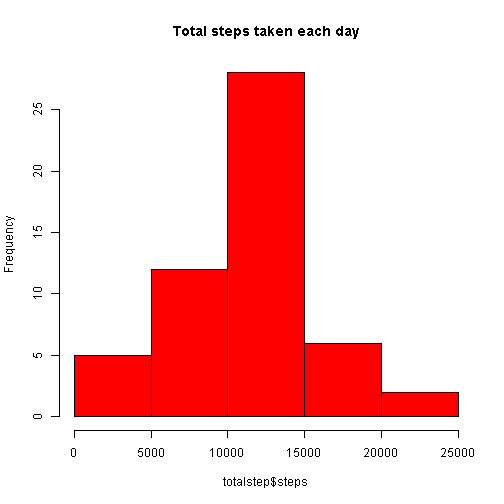
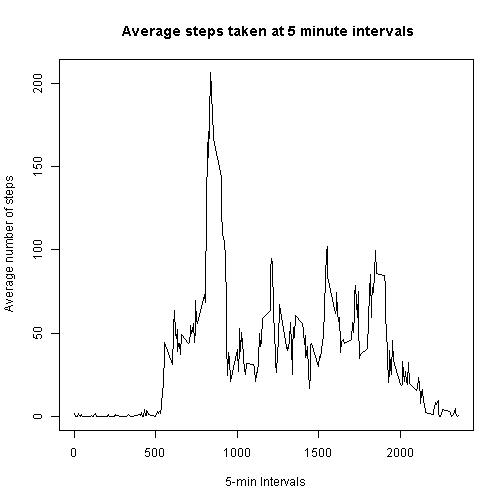
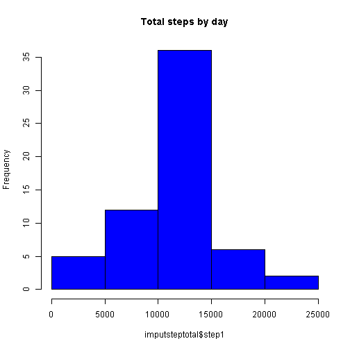
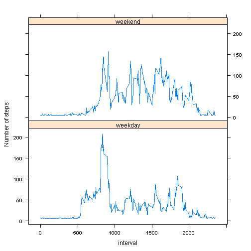

Reproducible Research Peer Assessment1
=============================================

##Loading and Preprocessing Data
### Load data

```r
setwd("C:/Users/nitin/Desktop/coursera/repres")
activity<- read.csv("activity.csv")
head(activity)
```

```
##   steps       date interval
## 1    NA 2012-10-01        0
## 2    NA 2012-10-01        5
## 3    NA 2012-10-01       10
## 4    NA 2012-10-01       15
## 5    NA 2012-10-01       20
## 6    NA 2012-10-01       25
```

###Transform the date attribute into actual date format 

```r
activity$date<- as.Date(activity$date, format="%Y-%m-%d")
class(activity$date)
```

```
## [1] "Date"
```

##What is mean total number of steps taken per day?

###1.calculate total number of steps per day

```r
totalstep<- aggregate(steps~date,activity,sum,na.rm=TRUE)
```

###2.Histogram plot showing total no. of steps taken each day

```r
hist(totalstep$steps,  main = "Total steps taken each day", col = "red")
```



###3.Calculate mean and median total number of steps taken per day

```r
totalstepmean<- mean(totalstep$steps)
totalstepmean
```

```
## [1] 10766.19
```

```r
totalstepmedian<- median(totalstep$steps)
totalstepmedian
```

```
## [1] 10765
```

##What is the average daily activity pattern?

###1. calculate averge steps at 5min interval per day

```r
stepinterval<- aggregate(steps~interval, data=activity,FUN=mean,na.rm=TRUE)
```

###2. Time series plot for mean step at every 5 min intervals

```r
plot(stepinterval$interval,stepinterval$steps,type="l",xlab="5-min Intervals",ylab="Average number of steps",  main=" Average steps taken at 5 minute intervals")
```



###3.Which 5-minute interval, on average across all the days in the dataset, contains the maximum number of steps?

```r
maxinterval<-stepinterval$interval[which.max(stepinterval$steps)]
maxinterval
```

```
## [1] 835
```

##Imputing missing values

###1.Compute total number of missing values in the dataset

```r
sum(is.na(activity$steps))
```

```
## [1] 2304
```

###2.Devise a strategy for filling in all of the missing values in the dataset

*Strategy: Replace missing values with mean value* 

```r
imputestep<-mean(activity$steps, na.rm=TRUE)
step1<- activity$steps
step1[is.na(step1)]<- imputestep
imputeactivity<- cbind(step1,activity[,2:3])
sum(is.na(imputeactivity$step1))
```

```
## [1] 0
```

###3.Make a histogram of the total number of steps taken each day

```r
imputsteptotal<- aggregate(step1~date,imputeactivity,sum,na.rm=TRUE)
hist(imputsteptotal$step1,  main = "Total steps by day", col = "blue")
```



###4. Mean and Median of total steps taken per day in imputed data

```r
imputemean<- mean(imputsteptotal$step1)
imputemean
```

```
## [1] 10766.19
```

```r
imputemedian<- median(imputsteptotal$step1)
imputemedian
```

```
## [1] 10766.19
```
*Result: No diffrence in mean and median values of original data and data with imputed NA(missing values)*

##Are there differences in activity patterns between weekdays and weekends?

###1.Create a new factor variable in the dataset with two levels - "weekday" and "weekend" 

```r
imputeactivity$daytype<- weekdays(imputeactivity$date)
D1<- imputeactivity$daytype=="Saturday" |imputeactivity$daytype=="Sunday"
imputeactivity$daytype[D1]<- "weekend"
imputeactivity$daytype[!D1]<- "weekday"
imputeactivity$daytype<- as.factor(imputeactivity$daytype)
```

###2.Time series plot of the 5-minute interval (x-axis) and the average number of steps taken, averaged across all weekday days or weekend days 

```r
imputestepday<- aggregate(step1~interval+daytype,imputeactivity,mean)
library(lattice)
xyplot(step1~interval|daytype, imputestepday, type="l",layout=c(1,2),ylab="Number of steps")
```




